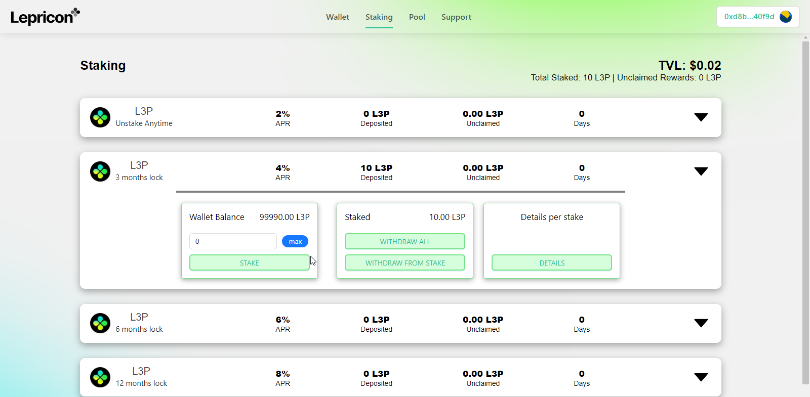

<div align="center">
 <h1><strong>Welcome to the NEW LEPRICON WALLET !!!</strong></h1>

[](https://github.com/superultra-io/Lepricon-wallet/stargazers)
[](https://github.com/superultra-io/Lepricon-wallet/issues)
[](https://github.com/superultra-io/Lepricon-wallet/blob/main/License)

</div>

-   All-in-One Dashbord": Access all info in one place: NFTs, Tokens, Staking and more!
-   Stake your tokens in different pools, with different yields.
-   Select an NFT from a compatible collection to gain some extra staking yield!

## Description

Brain new All-in-One wallet for your favorite Lepricon ecosystem! Accessible on the Polygon Network. Your Lepricon NFTs emitted on Ethereum are also compatible, thanks to our cross-chain wallet!



## Front-end Installation

💿 Clone the repo and install all dependencies:

```sh
git clone https://github.com/superultra-io/Lepricon-wallet.git
cd Lepricon-wallet
yarn install
```

✏ Edit the `.env.example` file in the main folder with all required info. Don't forget to remove `.example` !

🔎 Locate the file constant.js in `src/data/constant.ts` and paste your smart-contracts addresses;

```jsx
// Production => Polygon
export const TOKEN = "";
export const LEPRICON_NFT = "";
export const STAKING = "";

// Development => Mumbai
export const TOKEN_TEST = "";
export const LEPRICON_NFT_TEST = "";
export const STAKING_TEST = "";
```

🔎 Locate the file constant.js in `src/data/abis` and paste your ABIs if you've made any changes to the smart-contracts;

```jsx
export const NFT_ABI = ["NFT ABI here...];
```

🚴‍♂️ Run your App:

Dev. mode:

```sh
yarn dev
```

Prod. mode:

```sh
yarn start
```

## Smart-contract deployement

💿 Move the the `hardhat` folder and install all dependencies:

```sh
cd hardhat
yarn install
```

✏ Edit the `.env.example` file in the main folder with all required info. Don't forget to remove `.example` !

✏ Edit the hardhat.config.ts as needed, if needed, then make sure to select the correct network in the package.json `script` section.

```json
"scripts": {
        ...
        "deploy": "hardhat run --network mumbai scripts/deploy.ts",
        ...
    },
```

💿 Test that everything is working as intended:

```sh
yarn test
```

💿 Deploy your contracts:

```sh
yarn deploy
```
